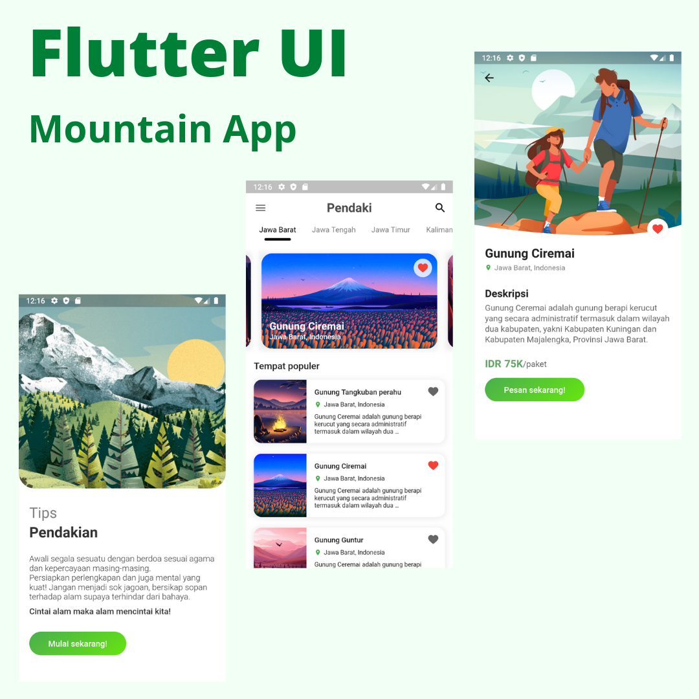

# Flutter UI - Mountain

Simple Flutter UI for Mountain App.



## Getting Started

This project is a starting point for a Flutter application.

A few resources to get you started if this is your first Flutter project:

- [Lab: Write your first Flutter app](https://flutter.dev/docs/get-started/codelab)
- [Cookbook: Useful Flutter samples](https://flutter.dev/docs/cookbook)

For help getting started with Flutter, view our
[online documentation](https://flutter.dev/docs), which offers tutorials,
samples, guidance on mobile development, and a full API reference.

## Clone

```
git clone https://github.com/rismandev/flutterUI-Mountain.git
```

## Contributtors


Risman Abdilah

## Connect with me

<div>
    <a href="tell:089647329246" target="_blank">
        
    </a>
    &nbsp;
    <a href="https://www.linkedin.com/in/rismandev" target="_blank">
        
    </a>
    &nbsp;
    <a href="https://www.facebook.com/risman.abdilah.58" target="_blank">
        
    </a>
    &nbsp;
    <a href="https://www.instagram.com/rismandev" target="_blank">
        
    </a>
</div>
